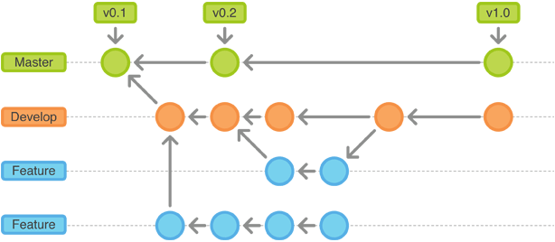

% Collaborative Science with git

# What is git?

- git is a version control system (VCS)
- What is a VCS?
- Records changes to a set of related files over time
- More specifically git is a **distributed** VCS
- DVCS enable collaboration in addition to version control

# Why use DVCS and git?

- backup
- collaboration (e.g., work w/ colleagues on Python APIs and Notebooks)
- open access
- reproducibility

# Getting started

- git is available on all modern platforms
- On Unix flavors, git is available via your favorite package manager
- On Windows, you will have to download a "git client"
- For the workshop, we have git installed for you

# Interacting with git

- There are a variety of tools
- Command line is what we will use for the workshop

# Configuration

- At a minimum you'll need to configure a user name and email
- `git config --global user.name "YOUR NAME"`
- `git config --global user.email "YOUR EMAIL ADDRESS"`
- See git configuration (i.e., `cat ~/.gitconfig`)

# What does a git repository contain?

- a series of snapshots of a working directory
- snapshots associated with a unique identifiers (e.g., 4f52d95)

# git repository

 

source: http://nyuccl.org/pages/GitTutorial/

# creating a git repository

- `git init <repository>`
- `cd` into repository
- note the .git directory that contains the history of the repository

# git file states

- **untracked**, git knows nothing of this file
- **modified**, git sees the file has changed since previous commit
- **commited**, the file is in the git version control

# git staging area

- assembly point en route to an eventual commit
- **untracked** and **modified** files must go through staging area before they are commited
- confusing for beginners but useful as you gain experience

# `git status`

- `git status` indicates state of **modfied** or **untracked** files in repository
- As you interact with your repo, you will use `git status` a lot

# git add

- Add untracked and modified files to staging area
- `git add <file>`
- `git reset <file>` will remove a file from staging area

# git commit

- Once staged, you are ready to commit
- A commit snapshots the entire repo at that point
- `git commit -m "my change" myfile`
- Keep commit messages, concise and meaningful

# git history

- `git log`
- "HEAD" is simply a pointer to the latest commit

# git branching

- Starts a new series of commits rooted from wherever you are branching from

# Why branch?

- Gather a series of commits tied to an idea or theme (e.g., feature, bug fix, experiment)
- Branching in git is lightweight (espcially compared to SVN) so you branch and merge all the time

# How to branch

- git has a default branch called "master", but there is really nothing special about it. It is just another branch.
- `git branch <branch>`
- The `branch` command will root itself in the current branch, whatever that branch maybe (e.g., master, feature branch)
- The `branch` command will create the branch, but will not switch to it.

# Checking out a branch

- `git checkout <branch>`

# Working on the branch

- Continue the add, commit lifecycle as you normally would
- Once you are done, you will (sometimes) want to merge

# As you get comfortable w/ branching

 

source: http://www.rittmanmead.com/2013/07/mds-xml4/

# git merging

- checkout the branch you wish to merge back onto
- merge branch

`git checkout master`

`git merge feature`

# dealing with merge conflicts

# git cloning and working with remote branches

- why?
- to collaborate
- often cloning from github

# remote branches

- really, just like any other branch

# pushing out changes

# what happens when a push get rejected

- Don't pull you hair out
- Must first sync up

# pull request

# pull request exercise

# git tools

 talk about tools at some point

# viewing git history

# What is github?

- It is a web-based hosting service for git repos
- student tiers (free?)

# commits

- a login snaphot of entire repo
- "under the hood" git store data efficiently and packs better than SVN

# File states

- untracked
- tracked, unmodfied
- track, modified
- staged

# create a repo or work out of an exinsting one

# status

# git log

# Example

# Branching

# Merging

# Remotes

# What is the HEAD?

# What is master?

# Pull requests

# Exercise Branch

# Exercise Merge

# Exercise send a pull request

# Resources

http://nyuccl.org/pages/GitTutorial/
http://www.sitepoint.com/git-for-beginners/
http://rogerdudler.github.io/git-guide/
# What is github?

