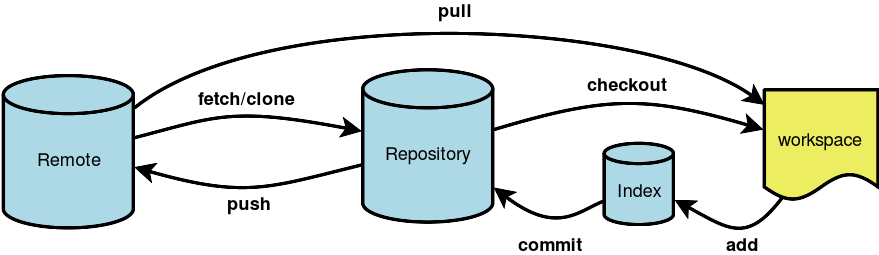

% Collaborative Science with git

# What is git?

- git is a version control system (VCS)
- What is a VCS?
- Records changes to a set of related files over time
- More specifically git is a **distributed** VCS
- DVCS enable collaboration in addition to version control

# Why use DVCS and git?

- Backup
- Collaboration (e.g., work w/ colleagues on Python APIs and Notebooks)
- Open access
- Reproducibility

# Getting started

- git is available on all modern platforms
- On Unix flavors, git is available via your favorite package manager
- On Windows, you will have to download a "git client"
- For the workshop, we have git installed for you

# Interacting with git

- There are a variety of tools
- **Command line** is what we will use for the workshop

# Configuration

- At a minimum you'll need to configure a user name and email
- `git config --global user.name "YOUR NAME"`
- `git config --global user.email "YOUR EMAIL ADDRESS"`
- See git configuration (i.e., `cat ~/.gitconfig`)

# What does a git repository contain?

- A series of snapshots of a working directory
- Snapshots associated with a unique identifiers (e.g., 4f52d95)

# git repository

 

source: http://nyuccl.org/pages/GitTutorial/

# Creating a git repository

- `git init <repository>`
- `cd` into repository
- Note the .git directory that contains the history of the repository

# git file states

- **untracked**, git knows nothing of this file
- **modified**, git sees the file has changed since previous commit
- **committed**, the file is in the git version control

# git staging area

- Assembly point en route to an eventual commit
- **untracked** and **modified** files must go through staging area before they are committed
- Confusing for beginners but useful as you gain experience

# `git status`

- `git status` indicates state of **modified** or **untracked** files in repository
- As you interact with your repo, you will use `git status` a lot

# git add

- Add untracked and modified files to **staging** area
- `git add <file>`
- `git reset <file>` will remove a file from staging area

# git commit

- Once staged, you are ready to commit
- A commit snapshots the entire repo at that point
- `git commit -m "my change"`
- Keep commit messages, concise and meaningful
- "under the hood" git stores data efficiently and packs better than SVN

# git history

- `git log`
- "HEAD" is simply a pointer to the latest commit

# git branching

- Starts a **new series of commits** rooted from wherever you are branching from

# git branch

 

source: http://git-scm.com/book/en/Git-Branching-Basic-Branching-and-Merging

# Why branch?

- Gather a series of commits tied to an idea or theme (e.g., feature, bug fix, experiment)
- Branching in git is lightweight (especially compared to SVN) so you branch and merge all the time

# How to branch

- git has a default branch called "**master**", but there is really nothing special about it. It is just another branch.
- To create a branch: `git branch <branch>`

# Branching continued

- The `branch` command will root the new branch in the current working branch, whatever that branch maybe (e.g., master, feature branch)
- The `branch` command will create the branch, but will not switch to it

# Checking out a branch

- `git checkout <branch>`
- **caveat:** git will complain if checkout will stomp on one or more files in the new branch
- In this situation, run `git status`, and resolve the problems by checking in or discarding the offending files
- Then try to checkout the branch again

# Working on the branch

- Continue the **add**, **commit** life cycle as you normally would
- Once you are done, you will (sometimes) want to **merge**

# As you get comfortable w/ branching

 

source: http://www.rittmanmead.com/2013/07/mds-xml4/

# git merging

- When you are ready to grab work from branch you will need to **merge**
- Checkout the branch you wish to merge back onto
- Merge branch

`git checkout master`

`git merge <branch>`

# git merge

 

source: http://git-scm.com/book/en/Git-Branching-Basic-Branching-and-Merging

# dealing with merge conflicts

- **Merge conflicts** happen when the same part of a file has been modified in different ways on two branches and you are trying to merge those branches together
- Not very common, but not unusual either
- Don't tear your hair out even though you will be tempted
- Remain calm :-)

# git merge conflict

 

source: http://git-scm.com/book/en/Git-Branching-Basic-Branching-and-Merging


# merge conflict workflow

- `git merge <branch>`
- Conflict reported by git
- Edit file (or use merge tool) to resolve conflict
- When editing deal with and remove `<<<<<<< ` `=======` `>>>>>>>` that describe the conflict
- `git add <file>`
- `git commit` or `git commit -m "my message"`
- Done

# git cloning, remote repositories, and collaboration

- Why?
- Collaborate
- Experiment with and build code
- Backup at remote location
- Collaboration happens through **remote** repositories
- Must know how to manage remote branches to collaborate

# What is github?

- It is a web-based hosting service for git repos
- Generally free, though repositories must be public
- There are free student tiers
- $ for private repos (though it never hurts to ask for free stuff)

# `git clone`

- Clones a repository into a local working directory
- Also automatically creates **remote** tracking branches

`git clone https://github.com/Unidata/conda-recipes`

# More on Remote repositories

- Remote repos is how you **collaborate** via git
- Remote repository must be somewhere on the network
- Or even on the local file system
- But is often a repository at github.com
- git is by no means tied or limited to github

# remote repositories

 

source: http://illustrated-git.readthedocs.org/en/latest/


# git cloning continued and remote branches

- **Remote branches** are references to a remote repository
- In this case, the repository you have cloned from
- After we have cloned let's look at our "remotes" w/ the `git remote -v` command:

# `git remote -v`

```
git clone https://github.com/unidata/conda-recipes
cd conda-recipes
git remote -v
origin	https://github.com/unidata/conda-recipes (fetch)
origin	https://github.com/unidata/conda-recipes (push)
```

Note that we have a **remote** named "origin"

#  `git remote show <remote>`

Will provide additional information on remote

```
remote origin
Fetch URL: https://github.com/unidata/conda-recipes
Push  URL: https://github.com/unidata/conda-recipes
HEAD branch: master
Remote branch:
    master tracked
Local branch configured for 'git pull':
    master merges with remote master
Local ref configured for 'git push':
    master pushes to master (fast-forwardable)
```

# Remote branches

- Note, _remotes are just branches_
- To list all branches including remote branches:

```
git branch -a

master
remotes/origin/HEAD -> origin/master
remotes/origin/master
```

# `git fetch`

- To get work of a collaborator, `git fetch`
- `git fetch`, will sync up your remote branches
- Can now **merge** remotes with local branches (e.g., master), but there is an **easier** way

# `git pull`

- `git pull` is actually `git fetch` and a  `git merge`
- Again, `git pull` will bring in the work of collaborators
- You may encounter a **merge conflict** here. Deal with merge conflict as before.

# `git push`

- `git push` is how you share your contributions
- Remote branches can be read only or read/write
- If you have write access, you can push

# What happens when a push get rejected

- Sometimes you are beat to the punch
- Don't pull you hair out
- `git pull`
- may have to deal w/ merge conflicts
- `git push`

# github forking to enable collaboration via "pull request"

- github allows copying of repositories **at github** with the fork button
- once you have a forked repo, add it as an "upstream" remote

# Adding additional upstream remotes to bring in other collaborators

- For example, if forking https://github.com/unidata/unidata-python-workshop
- `git clone https://github.com/USERNAME/unidata-python-workshop`
- `git add remote upstream https://github.com/USERNAME/unidata-python-workshop`
Then you can
- `git push upstream master`
- `git pull upstream master`
- Once you have pushed your changes to an upstream master or better yet a feature branch, issue a pull request

# pull requests

- for a variety of reasons including not having write permissions, it is best to issue a *pull request* to a collaborator
- **pull requests are a github not git concept**
- There may be a period of discussion before the pull request is accepted

# Common problems

- merge conflicts (either for local or remote branches)
- pushes that are rejected

# What we did not cover

- stashing
- rebasing

# Resources

http://nyuccl.org/pages/GitTutorial/
http://www.sitepoint.com/git-for-beginners/
http://rogerdudler.github.io/git-guide/
http://illustrated-git.readthedocs.org

